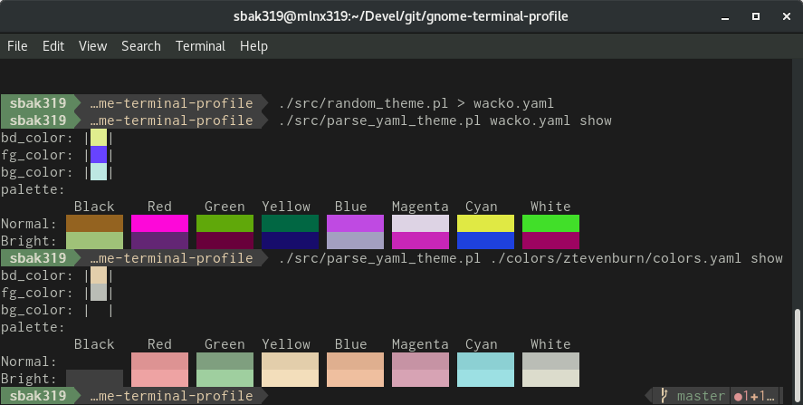
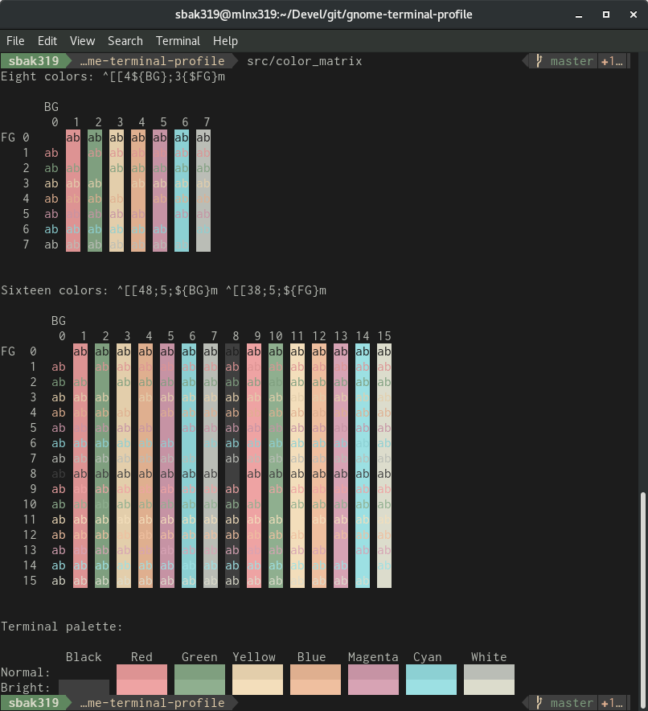
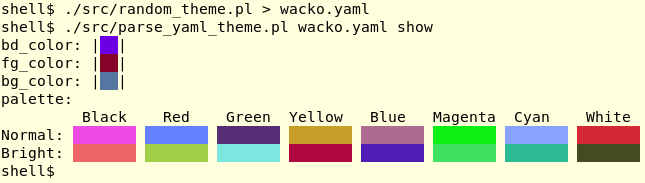
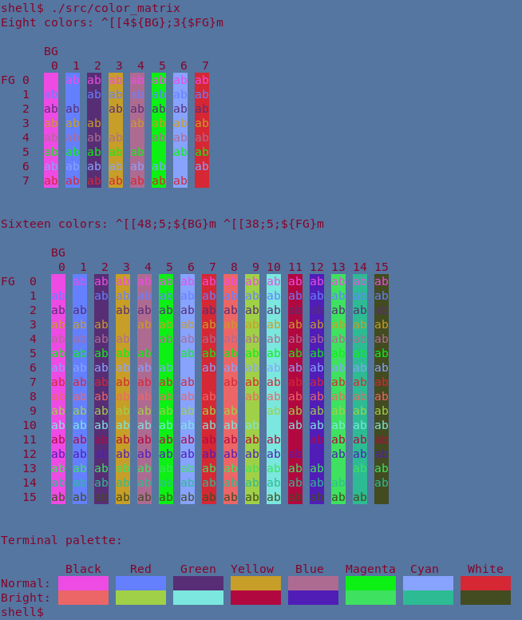

# YAML Color schemes for Gnome Terminal

Script(s) for defining Gnome Terminal themes with a YAML file.

Builds on [Anthony25's gnome-terminal-colors-solarized] for solarized Gnome Terminal colours (the
repository is added as a submodule of this repository).

This repository comes with two YAML-base themes: *zenburn* and *ztevenburn*.
The zenburn theme is based on [planbnet's gnome-terminal-zenburn.sh], while
*ztevenburn* similar to Zenburn, but with more contrast (i.e. a darker
background).

Screenshot for comparison:


## Copyright & License

Copyright (C) 2017  Steven Bakker

This program is free software: you can redistribute it and/or modify
it under the terms of the GNU General Public License as published by
the Free Software Foundation, either version 3 of the License, or
(at your option) any later version.

This program is distributed in the hope that it will be useful,
but WITHOUT ANY WARRANTY; without even the implied warranty of
MERCHANTABILITY or FITNESS FOR A PARTICULAR PURPOSE.  See the
GNU General Public License for more details.

You should have received a copy of the [GNU General Public License](LICENSE)
along with this program.  If not, see [<http://www.gnu.org/licenses/>](http://www.gnu.org/licenses/).

## Requirements

### Perl

The following modules should be part of the default Perl installation:

  * `File::Basename`
  * `FindBin`
  * `Getopt::Long`
  * `Time::Piece`

The following modules will probably need to be installed separately:

  * `Modern::Perl`
  * `Pod::Usage`
  * `YAML`

## Initialisation

```
git clone git@github.com:sbakker/gnome-terminal-profile.git
git submodule init
```

## Usage

See the POD documentation of `parse_yaml_theme.pl`

```
perldoc src/parse_yaml_theme.pl

src/parse_yaml_theme.pl --manual
```

### Standalone usage

The `install.sh` script was copied from [Anthony25's gnome-terminal-colors-solarized]
repository and modified to include the use of the YAML parser.

```
git submodule init
mkdir -p ./colors/my-color

# ... create a colors.yaml in ./colors/my-color

./install.sh
```

### Using with gnome-terminal-colors-solarized

To use with [Anthony25's gnome-terminal-colors-solarized] repository:

Copy your YAML file to a new directory in the `colors` directory:

```
mkdir /path/to/gnome-terminal-colors-solarized/my-theme
cp my-theme.yaml /path/to/gnome-terminal-colors-solarized/my-theme/colors.yaml
```

Then, "compile" it to create the appropriate files:

```
src/parse_yaml_theme.pl /path/to/gnome-terminal-colors-solarized/my-theme/colors.yaml compile
```

Finally, use the `install.sh` script to install the colour theme.

```
cd /path/to/gnome-terminal-colors-solarized
./install.sh
```

## Scripts

### parse_yaml_theme.pl

Parse a YAML-based theme.

```
$ src/parse_yaml_theme.pl ./colors/ztevenburn/colors.yaml
bd_color='#E3CEAB'
bg_color='#1C1C1C'
fg_color='#BABDB6'
palette=( '#1C1C1C' '#DD9393' '#7F9F7F' '#E3CEAB' '#DFAF8F' '#C693A4'
'#8CD0D3' '#BABDB6' '#3F3F3F' '#EEA3A3' '#9FCF9F' '#F3DEBB' '#EFBF9F'
'#D7A3B4' '#9CE0E3' '#DCDCCC' )
```

Also has a preview option with the `show` sub-command:



### color_matrix

Show a matrix of the terminal colours. Example with the `ztevenburn` theme:



### random_theme.pl

Fun stuff for generating a completely random colour theme. Script spits out a
random YAML configuration.

To generate, use `random_theme.pl` and run `parse_yaml_theme.pl` to show the
results:

```
shell$ src/random_theme.pl > wacko.yaml
shell$ src/parse_yaml_theme.pl wacko.yaml show
```

This will look something like:



Then, save the YAML file in a theme directory and install the theme:

```
shell$ mkdir -p colors/wacko
shell$ mv wacko.yaml colors/wacko/colors.yaml
shell$ ./install.sh -p Wacko -s wacko
```

The result will then be something like:



---

[Anthony25's gnome-terminal-colors-solarized]: https://github.com/Anthony25/gnome-terminal-colors-solarized
[planbnet's gnome-terminal-zenburn.sh]: https://gist.github.com/planbnet/1422472
