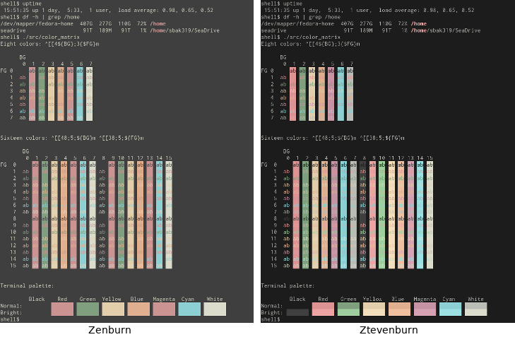
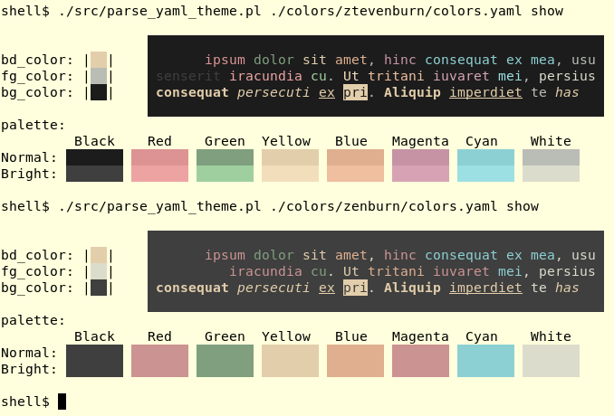
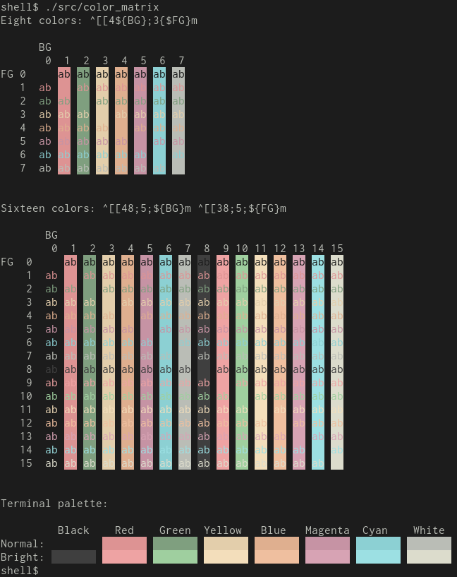
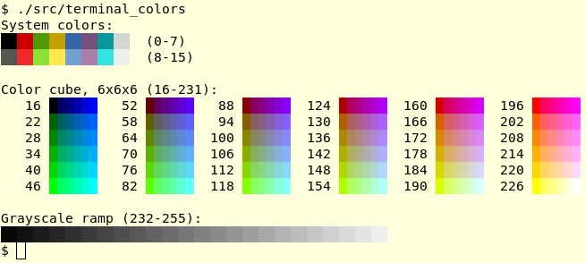
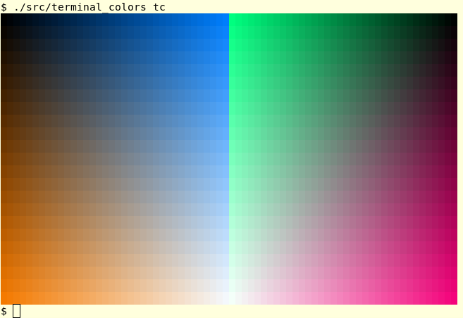
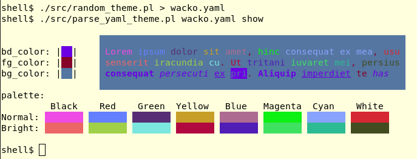

# YAML Color schemes for Gnome Terminal

Script(s) for defining Gnome Terminal (or Roxterm) themes with a YAML file.

Builds on [Anthony25's gnome-terminal-colors-solarized] for solarized Gnome Terminal colours (the
repository is added as a submodule of this repository).

This repository comes with two YAML-base themes: *zenburn* and *ztevenburn*.
The zenburn theme is based on [planbnet's gnome-terminal-zenburn.sh], while
*ztevenburn* similar to Zenburn, but with more contrast (i.e. a darker
background).

Screenshot for comparison:



## Copyright & License

Copyright (C) 2017  Steven Bakker

This program is free software: you can redistribute it and/or modify
it under the terms of the GNU General Public License as published by
the Free Software Foundation, either version 3 of the License, or
(at your option) any later version.

This program is distributed in the hope that it will be useful,
but WITHOUT ANY WARRANTY; without even the implied warranty of
MERCHANTABILITY or FITNESS FOR A PARTICULAR PURPOSE.  See the
GNU General Public License for more details.

You should have received a copy of the [GNU General Public License](LICENSE)
along with this program.  If not, see [<http://www.gnu.org/licenses/>](http://www.gnu.org/licenses/).

## Requirements

### Perl (5.14 or later)

The following modules should be part of the default Perl installation:

  * `File::Basename`
  * `FindBin`
  * `Getopt::Long`
  * `Time::Piece`

The following modules will probably need to be installed separately:

  * `Pod::Usage`
  * `YAML`
  * `Term::ReadKey`

## Initialisation

```
git clone git@github.com:sbakker/gnome-terminal-profile.git
git submodule init
```

## Usage

See the POD documentation of `parse_yaml_theme.pl`

```
perldoc src/parse_yaml_theme.pl

src/parse_yaml_theme.pl --manual
```

### Standalone usage

The `install.sh` script was copied from [Anthony25's gnome-terminal-colors-solarized]
repository and modified to include the use of the YAML parser.

```
git submodule init
mkdir -p ./colors/my-color

# ... create a colors.yaml in ./colors/my-color

./install.sh
```

### Using with gnome-terminal-colors-solarized

To use with [Anthony25's gnome-terminal-colors-solarized] repository:

Copy your YAML file to a new directory in the `colors` directory:

```
mkdir /path/to/gnome-terminal-colors-solarized/my-theme
cp my-theme.yaml /path/to/gnome-terminal-colors-solarized/my-theme/colors.yaml
```

Then, "compile" it to create the appropriate files:

```
src/parse_yaml_theme.pl /path/to/gnome-terminal-colors-solarized/my-theme/colors.yaml compile
```

Finally, use the `install.sh` script to install the colour theme.

```
cd /path/to/gnome-terminal-colors-solarized
./install.sh
```

### Converting gnome-terminal-colors-solarized profiles

Any "classic" profiles can be converted to YAML with the
`convert_solarized.sh` script.

```
$ ./convert_solarized.sh
converting gnome-terminal-colors-solarized/colors/dark
converting gnome-terminal-colors-solarized/colors/dark_alternative
converting gnome-terminal-colors-solarized/colors/light
```

## Scripts

### install.sh

Copy of [Anthony25's gnome-terminal-colors-solarized]'s `install.sh` script
with small modifications to load YAML-base color schemes.

### convert_solarized.sh

Script to convert "classic" color scheme formats to YAML-based. Just point it
to a directory with a "colors" sub-directory (and optionally specify a prefix
to use for the YAML-based output directory) and the script will do the rest.

### show_theme.sh

Can show classic and YAML-based color themes.

```
# Look in colors/ztevenburn/colors.yaml
./show_theme colors/ztevenburn/colors.yaml
./show_theme ztevenburn

# Looks in "classic" gnome-terminal-colors-solarized/colors/light
./show_theme gnome-terminal-colors-solarized/colors/light
```

### src/parse_yaml_theme.pl

Parse a YAML-based theme.

```
$ src/parse_yaml_theme.pl ./colors/ztevenburn/colors.yaml
bd_color='#E3CEAB'
bg_color='#1C1C1C'
fg_color='#BABDB6'
palette=( '#1C1C1C' '#DD9393' '#7F9F7F' '#E3CEAB' '#DFAF8F' '#C693A4'
'#8CD0D3' '#BABDB6' '#3F3F3F' '#EEA3A3' '#9FCF9F' '#F3DEBB' '#EFBF9F'
'#D7A3B4' '#9CE0E3' '#DCDCCC' )
```

Also has a preview option with the `show` sub-command:



### src/color_matrix

Show a matrix of the terminal colours. Example with the `ztevenburn` theme:



### src/ramp_color

Only works well on a TrueColor terminal.

Given a start color, display a color ramp of increasingly lighter or darker colors, and a demonstration of these colors in a text string.


See `perldoc src/ramp_color` for more information.

### src/terminal_colors

Modified clone of the XFree86 `256colors.pl`. Can print a 256 colour map as well as a list of all extended colors and their RGB values or a visually pleasing spectrum (the latter only for TrueColor terminals).

See `perldoc src/terminal_colors` for more information.





### src/random_theme.pl

Fun stuff for generating a completely random colour theme. Script spits out a random YAML configuration.

To generate, use `random_theme.pl` and run `parse_yaml_theme.pl` to show the
results:

```
shell$ src/random_theme.pl > wacko.yaml
shell$ src/parse_yaml_theme.pl wacko.yaml show
```

This will look something like:



Then, save the YAML file in a theme directory and install the theme:

```
shell$ mkdir -p colors/wacko
shell$ mv wacko.yaml colors/wacko/colors.yaml
shell$ ./install.sh -p Wacko -s wacko
```

The result will then be something like:


### src/theme_to_yaml.pl

Create a YAML file from a "classic" theme (or display a "classic" theme).

Example:
```
$ src/theme_to_yaml.pl gnome-terminal-colors-solarized/colors/light
```

Output:
```
# YAML dump of gnome-terminal-colors-solarized/colors/light/
# Generated by theme_to_yaml.pl, 30-Nov-2017 16:12:29 +0100
---
bd: &bd '#58586E6E7575'
fg: &fg '#65657B7B8383'
bg: &bg '#FDFDF6F6E3E3'
color0: [ '#070736364242', '#00002B2B3636' ]
color1: [ '#DCDC32322F2F', '#CBCB4B4B1616' ]
color2: [ '#858599990000', *bd ]
color3: [ '#B5B589890000', *fg ]
color4: [ '#26268B8BD2D2', '#838394949696' ]
color5: [ '#D3D336368282', '#6C6C7171C4C4' ]
color6: [ '#2A2AA1A19898', '#9393A1A1A1A1' ]
color7: [ '#EEEEE8E8D5D5', *bg ]
```

---

[Anthony25's gnome-terminal-colors-solarized]: https://github.com/Anthony25/gnome-terminal-colors-solarized
[planbnet's gnome-terminal-zenburn.sh]: https://gist.github.com/planbnet/1422472
